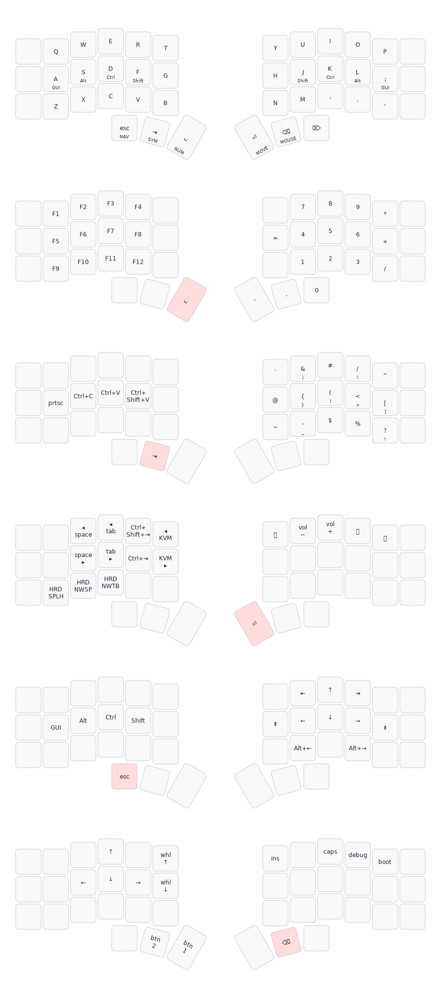

# pones' QMK Userspace

Personal [QMK](https://qmk.fm) keymaps, built as an external userspace. The main
build is a **Corne (crkbd/rev1)** split keyboard with a programming-focused,
home-row-mod layout.



> The image above is generated from `keymap.c` with
> [keymap-drawer](https://github.com/caksoylar/keymap-drawer) and kept in sync by
> a pre-commit hook — see [Keymap image](#keymap-image).

## Layout at a glance

Base layer uses **home row mods** and a 6-key thumb cluster where every thumb is a
tap on one key and a hold into a layer. Split halves use **EE_HANDS** (handedness
stored in EEPROM), so either half can take the USB cable.

### Layers

| Layer | Reached by | Purpose |
|---|---|---|
| `_QWERTY` | base | Letters + home-row mods |
| `_NUMBER` | hold **Space** | Numbers, F-keys, math operators |
| `_SYMBOL` | hold **Tab** | Symbols and brackets (tap-dance pairs) |
| `_MOVE` | hold **Enter** | Window management (herdr / KVM), Ctrl+Tab |
| `_NAV` | hold **Esc** | Arrows, word-jump, Page Up/Down |
| `_MEDIA` | hold **Delete** | Media controls, boot, utility keys |
| `_MOUSE` | hold **Backspace** | Mouse movement, clicks, and wheel |

### Home row mods

| Hand | A / ; | S / L | D / K | F / J |
|---|---|---|---|---|
| Left | GUI | Alt | Ctrl | Shift |
| Right | GUI | Alt | Ctrl | Shift |

Ctrl (D) has a same-hand exemption via Chordal Hold so left-handed `Ctrl+W/R/F`
etc. stay usable.

### Thumb cluster

| Thumb | Tap | Hold |
|---|---|---|
| Left 1 | Esc | `_NAV` |
| Left 2 | Tab | `_SYMBOL` |
| Left 3 | Space | `_NUMBER` |
| Right 1 | Enter | `_MOVE` |
| Right 2 | Backspace | `_MOUSE` |
| Right 3 | Delete | `_MEDIA` |

### Combos

Fast shortcuts without an extra hold:

| Combo | Action |
|---|---|
| **F + J** | Caps Word |
| **A + S** | Ctrl+Backspace (delete word left) |
| **S + D** | Alt+Backspace (delete word left) |
| **K + L** | Alt+Delete (delete word right) |
| **L + ;** | Ctrl+Delete (delete word right) |

## Build & flash

```bash
# Compile
qmk compile -kb crkbd/rev1 -km pones

# Flash (handedness already set): enter the bootloader with QK_BOOT —
# hold Delete (opens _MEDIA) + tap Q — then:
qmk flash -kb crkbd/rev1 -km pones
```

First-time setup, if this userspace isn't wired up yet:

```bash
qmk config user.overlay_dir="$(realpath .)"
```

## Keymap image

`docs/keymap.svg` is generated from the current `keymap.c`:

```bash
bash gen-keymap-svg.sh          # needs: pipx install keymap-drawer
```

`qmk c2json` can't parse this keymap (it silently drops repeated `#define`'d
keycodes), so `parse_keymap.py` expands the macros itself before handing off to
keymap-drawer.

To regenerate automatically on every keymap change, enable the pre-commit hook
once:

```bash
git config core.hooksPath .githooks
```

## Layout reference

Full layer diagrams and design rationale live in
[`docs/keymap-redesign-plan.md`](docs/keymap-redesign-plan.md).
